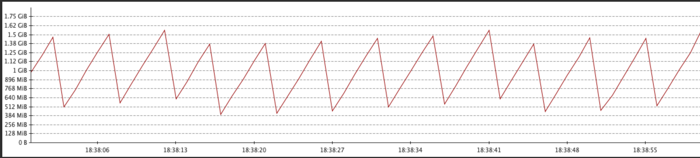
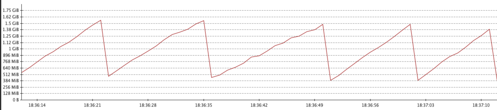

# Scala 3 compiler plugin to optimize collection chained calls
This is a scala 3 compiler plugin and a small library. The purpose of it is to optimize collection calls like `seq.filter().map()` to
a single call that will optimize the call and skip extra collection creation and be faster.

## micro-benchmark results

I wrote a micro benchmark which compares performance of chained calls, i.e. `seq.filter().map()`, to the replacement single call (in this case to `SeqOps.filterMap`) and
both there is a speed increase and garbage generation decrease. For the micro-benchmarks that it just has very simple logic in the `filter()` and `map()`, this results
in sometimes multiples of performance increase and having less garbage collections magnify that. For real time application, the cost of the filter & map lambdas will reduce the benefits of the plugin, 
but still it may result in good gains for parts of the code with simple code logic in those lambdas.

## GC impact

Because these chained calls are transformed to 1 call, intermediate collection creation is skipped and this has an effect
in the number of garbage that are generated at runtime.

In a project of mine, I've a stress test for some parts of the code. This is the pattern of memory usage without the plugin:



and with the plugin:




## What is optimized right now?

These:

```
iterable.filter(...).map(...)
iterable.map(...).filter(...)
iterable.filter(...).forall(...)
iterable.withFilter(...).foreach(...)
list.map(...).find(...)
```
(note: iterable includes seq and list, most seq optimizations are only on lists which is the default class when creating a seq)

## Using the plugin

Currently, nothing is published to nexus, so you'll have to checkout the plugin:

run
```
git clone https://github.com/kostaskougios/code-optimizer.git
cd code-optimizer
bin/build-plugin-and-publishlocal-lib
```

This will build the plugin and also publish locally the small library, `code-optimizer-lib`, that replaces chained calls.

### Adding the plugin to your project
Then add the generated jar as a scalac plugin to your scala 3 project, i.e. (replace $FULLPATH with the full path where the plugin directory is)

```
ThisBuild / scalacOptions ++= Seq(
  "-Xplugin: $FULLPATH/code-optimizer/target/scala-3.7.2/compiler-plugin-assembly-0.1.0.jar"
)
```

Also add the library to your project, i.e. in your `build.sbt`:

```
libraryDependencies += "org.kkougios" %% "code-optimizer-lib" % "0.1.0"
```

And you're good to go. 

### Compiling your code

Try clean compiling your code, and you should see some output from the plugin. It will print which calls were optimized like:

```
[FilterMapOptimizer] Optimizing filter→map to IterableOps.filterMap at BattleReplay.scala:22
```

Also it will print where it found potential optimizable chained calls. For some of them the optimization will be performed straight away, so you will see
a msg from `[FilterMapOptimizer]` but if you don't see that msg it means the optimization is not yet implemented (your code will work fine).
```
[StatisticsCollectorForIterable] List.find.map at BuildCost.scala:13
```
At the end of the compilation it will print statistics of frequency of chained calls:

```
┌────────────────────────────────┬───────┐
│ Name                           │ Count │
├────────────────────────────────┼───────┤
│ Seq.$plus$plus.$plus$plus      │ 14    │
│ List.map.sum                   │ 13    │
│ List.map.maxOption             │ 11    │
│ List.maxOption.getOrElse       │ 9     │
│ List.map.mkString              │ 8     │
│ List.filter.map                │ 8     │
│ Seq.withFilter.map             │ 5     │
│ List.$plus$plus.$plus$plus     │ 4     │
```

So in my code seq.++().++() is found 14 times. You can report these to me if you want so that I can plan some extra chained call optimizations (maybe this plugin will also expanded to 3 chained calls).


## Things to be aware of

Some optimizations are not equivalent to their original chained call. I.e. ```list.map().find()``` is rewritten to `ListOps.mapFind` which will not map all elements of the list before calling find. It will map until it finds the first
result and then stop. This will affect code that has side effects in the map part but no-side effect code should work fine.

## Troubleshooting

If you get a compilation error like
`[error] value <none> is not a member of object codeoptimizer.ListOps`
then you should add `code-optimizer-lib` to your classpath. 